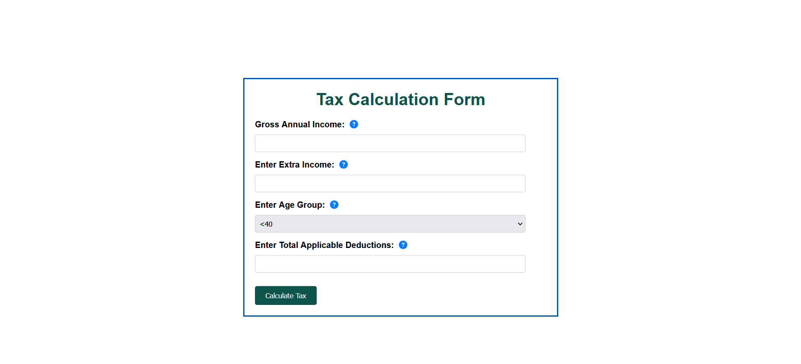
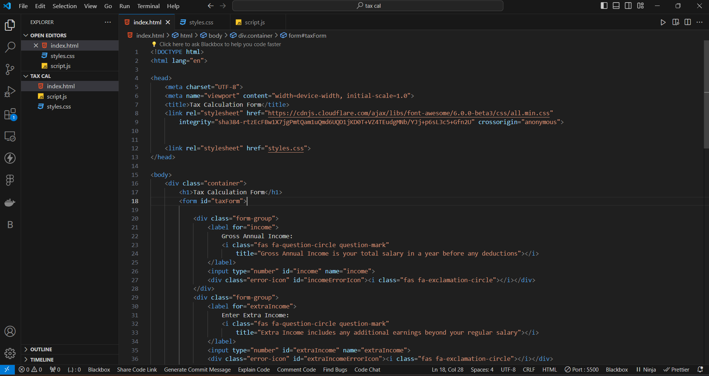
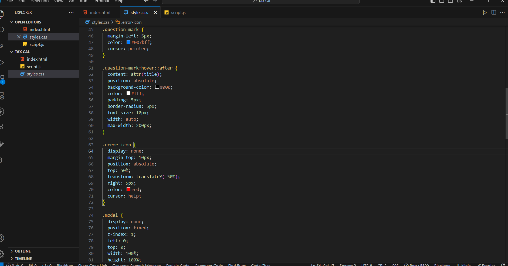
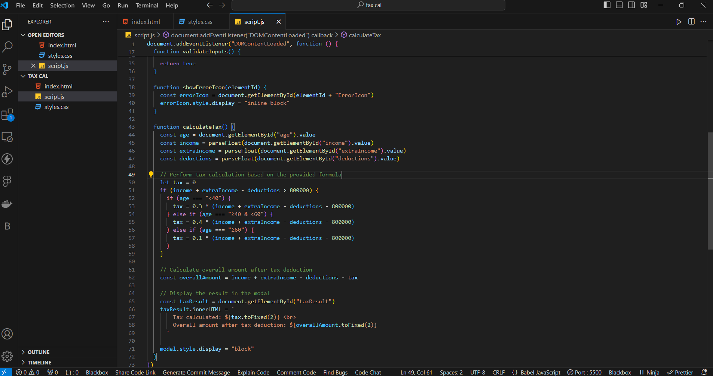
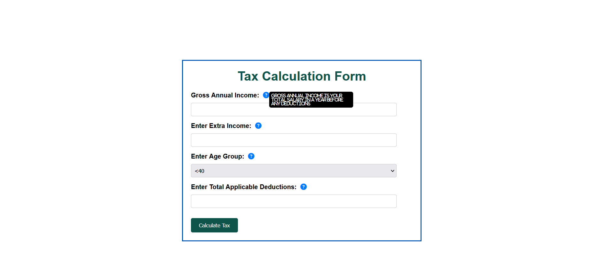
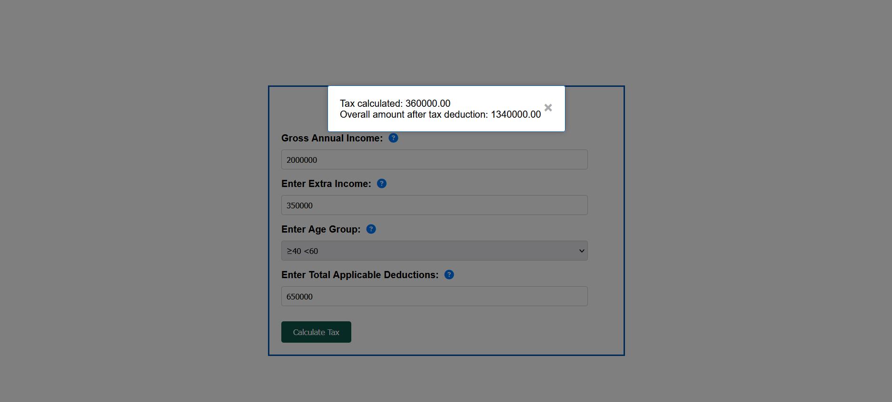

# Fyle Web Development Internship Challenge

Welcome to my submission for the Fyle Web Development Internship Challenge! In this project, I've developed a tax calculator web application based on the provided requirements.

## Project Overview

The tax calculator web application allows users to input their income, deductions, and age to calculate their tax liability according to the specified tax formula. The application features a clean and intuitive user interface with error handling and validation to ensure a smooth user experience.

## Technologies Used

- HTML
- CSS
- JavaScript
- Fontawsom icon

## Key Features

- User-friendly interface for inputting income, deductions, and age.
- Error handling to highlight and notify users of invalid input.
- Age dropdown menu with mandatory selection.
- Tax calculation logic based on the provided formula.
- Modal display of tax calculation results.

## How to Use

To use the tax calculator web application, follow these steps:

1. Clone the repository to your local machine.
2. Open the `index.html` file in your web browser.
3. Input your income, deductions, and select your age group.
4. Click the "Submit" button to calculate your tax.
5. View the modal window displaying the calculated tax amount and details.

## Screenshots

## Demo

Check out the live version of the application [here](https://abhinavnist.github.io/tax-calculator/).

## Tests

Thank you for reviewing my submission! I'm excited about the opportunity to potentially intern at Fyle and contribute to the Web Development team.
